<h1 align="center">
    Transparência de Atos Jurídicos API
</h1>

## Sobre o projeto

Para fins de demonstração e aprendizado, resolvi reconstruir um sistema meu antigo, utilizando as melhores práticas e tecnologias atuais referente ao cenário backend PHP e Laravel. Nesse repositório, encontra-se uma API que servirá de apoio a outro sistema frontend. 

O objetivo do sistema é servir dados referente a transparência de atos jurídicos de um determinado órgão público. Entenda-se ato jurídico como qualquer documento público que está sujeito a legislações vigentes de transparência pública, como avisos de licitações, contratos públicos, etc.

Nos tópicos deste documento, exemplificarei as escolhas adotadas no desenvolvimento do sistema, a fim de demonstrar possíveis abordagens com Laravel.

Caso encontre algum erro, ou abordagem que poderia ser melhorada, não hesite em entrar em contato ou abrir uma PR. Eu também me considero um eterno aprendiz, e sei que ainda tenho muito a melhorar. Acredito que a força da comunidade que nos torna fortes. 

## Tecnologias:
- **[PHP 8.1](https://www.php.net)**
- **[Laravel](https://laravel.com/)**
- **[MySQL](https://www.mysql.com/)**
- **[Redis](https://redis.io/)**
- **[MailHog](https://github.com/mailhog/MailHog)**
- **[MinIO](https://min.io/)**
- **[Amazon S3](https://aws.amazon.com/pt/s3/)**
- **[Laravel Request Docs](https://github.com/rakutentech/laravel-request-docs)**
- **[PHPUnit](https://phpunit.de)**
- **[FakePHP](https://fakerphp.github.io)** 

## Features

### CRUD

Deve ser possível adicionar, visualizat, editar e remover registros referente a Atos Jurídicos (Legal Acts).

Todo Ato Jurídico pertence a um Tipo (Type), através do relacionamento belongsTo na model LegalAct

```php
class LegalAct extends Model {

    public function type()
        {
            return $this->belongsTo(Type::class);
        }
}
```
Para ser possível manipular esses models, foi criado dois controllers com os métodos resources
```php
class LegalActController extends Controller
{
    public function index(FilterLegalActsRequest $request) { ... }
    public function store(LegalActRequest $request) { ... }
    public function show($id) { ... }
    public function update(LegalActUpdateRequest $request, $id) { ... }
    public function destroy($id) { ... }
}

```
```php
class TypeController extends Controller
{
    public function index() { ... }
    public function store(TypeRequest $request) { ... }
    public function show($id) { ... }
    public function update(TypeRequest $request, $id) { ... }
    public function destroy($id) { ... }
}

```
### Proteção de rotas
As rotas de listagem e visualização de Atos Jurídicos são públicas.
```php
Route::apiResource('legalacts', LegalActController::class)->only([
    'index', 'show'
]);
```
As rotas para manipulação de registros são protegidas via autenticação por token, e também por política de autorização.
```php
Route::middleware(['auth:sanctum', 'can:manage_records'])->group(function () {
    Route::apiResource('legalacts', LegalActController::class)->only([
        'store', 'update', 'destroy'
    ]);
});
```
### Documentação de API
Consumir uma API pode ser trabalhoso quando não se tem nenhuma referência de como ela funciona. Pensando nisso, utilizei um pacote terceiro chamado Laravel Request Doc, que se trata de uma alternativa ao Swagger e se baseia nos design patterns do Laravel para gerar uma documentação com todos endpoints e seus parâmetros. 
<h4 align="center">
    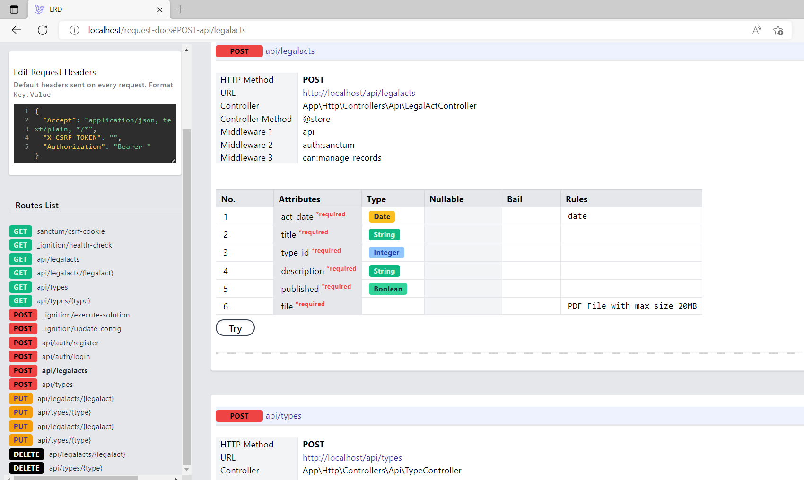
</h4>
Além disso é possível fazer chamadas na própria documentação, verificando os retornos de cada endpoint. 
<h4 align="center">
    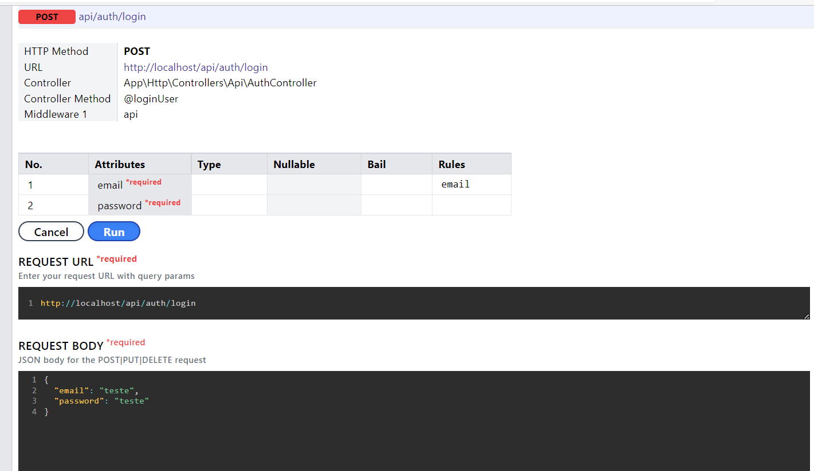
    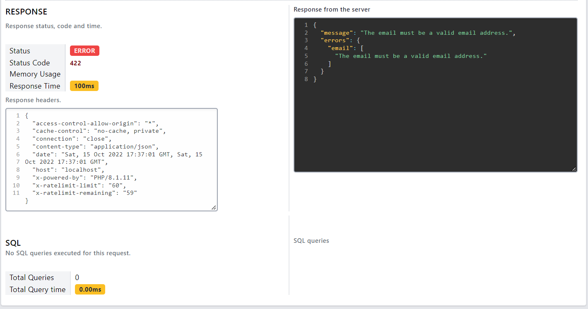
</h4>

### Filtro de Atos Jurídicos
No end point index de atos jurídicos (api/legalacts) é possível passar parâmetros para filtrar os registros. Através do FormRequest FilterLegalActRequest, o pacote Laravel Request Doc documenta automaticamente os possívels parâmetros da pesquisa.
<h4 align="center">
    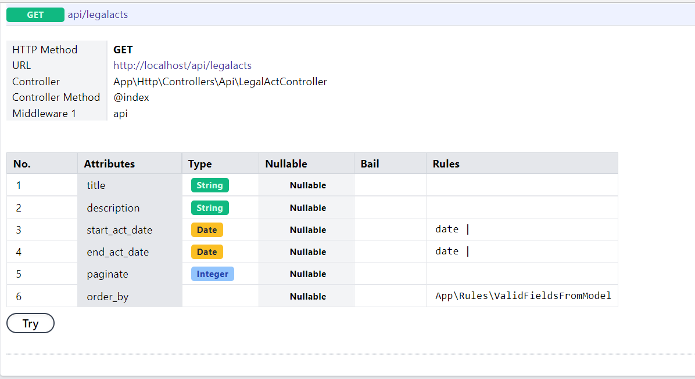
</h4>

### Validação de políticas de autorização
Como regra de negócio, foi definido a existência de dois perfis de acesso, sendo o perfil "Administrador" e perfil "Cidadão". O perfil Cidadão se refere ao usuário que poderá se cadastrar no sistema para receber notificações de novos atos jurídicos publicados. Porém atos jurídicos não publicados não devem aparecer para ele. Dessa forma, foi aplicado uma diretiva de acesso em um escopo global de consulta do model LegalAct.
```php
class LegalAct extends Model
{
    ...
    protected static function booted()
        {
                static::addGlobalScope('published', function (Builder $builder) {
                        if (!auth('sanctum')->check())
                        {
                            $builder->where('published', true);

                        }
                        else if (auth('sanctum')->user()->cannot('see_published_legalacts'))
                        {
                            $builder->where('published', true);
                        }
                });
        }
     ...
 } 
```
```php
class AuthServiceProvider extends ServiceProvider
{
    public function boot()
    {
        ...
        Gate::define('see_published_legalacts', function (User $user) {
            return $user->isAdmin;
        });
        ...
    }

}
```
### Salvamento de arquivos na Amazon S3
O Amazon Simple Storage Service (Amazon S3) é um serviço de armazenamento de objetos que oferece escalabilidade, disponibilidade de dados, segurança e performance. O Laravel pode integrá-lo facilmente, apenas configurando-o com os chaves de acesso e instalando a versão 3 do pacote [League\Flysystem](https://github.com/thephpleague/flysystem). 
Neste projeto o S3 foi configurado como armazenamento padrão adicionando a diretiva FILESYSTEM_DISK=s3 no .env. Dessa forma, fica simples operá-lo pelo sistema, como no caso do exemplo abaixo foi utilizado para gerar uma url temporária para acesso a um arquivo. 
```php
class LegalActController extends Controller
{
    public function getFile($id)
        {
            $legalAct = LegalAct::findOrFail($id);
            return Storage::temporaryUrl(
                $legalAct->id.'/'.$legalAct->file,
                now()->addMinutes(5),
            );
        }
}
```
### Subscrição para receber notificação referente a novos atos jurídicos
Foi implementado novos endpoints que permitem o gerenciamento de subscrições, as quais serão utilizadas para notificar aos usuários sobre a publicação de novos atos jurídicos. Por exemplo, o usuário deseja receber notificações a novos atos jurídicos do tipo "Aviso de Licitação", então quando um novo ato for publicado, o sistema irá dispará um evento que notificará todos que um novo ato foi publicado, conforme exemplo na imagem a seguir. 
<h4 align="center">
    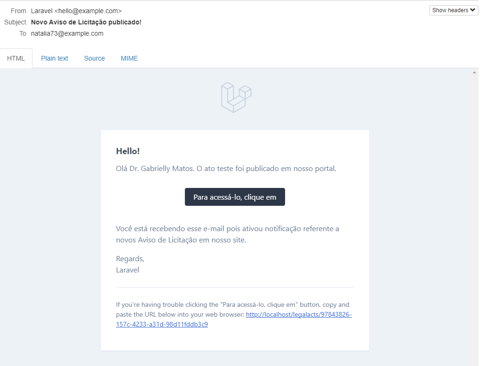
</h4>

O disparo desse evento acontece no controller após o salvamento do ato jurídico(legal act).
```php
class LegalActController extends Controller
{
    ...
    public function store(LegalActRequest $request)
    {
        $legalAct = LegalAct::create($request->all());
        $file = $request->file('file');
        Storage::putFileAs($legalAct->id, $file, $file->getClientOriginalName());
        //Disparo do evento de novo ato juridico
        LegalActPublished::dispatchIf($legalAct->published, $legalAct);

        return new LegalActResource($legalAct);
    }
    ...
 } 
 ```
 <h4 align="center">
    
</h4>

## Boas práticas em Laravel
### Acessors and Mutators
O atributo isAdmin foi implementado através de um [acessor](https://laravel.com/docs/9.x/eloquent-mutators#defining-an-accessor) que verifica o perfil de cadastro do Usuário.
```php
class User extends Authenticatable
{
    ...
    protected function isAdmin() : Attribute
    
        return Attribute::make(
            get: fn($value, $attributes) => $attributes['profile'] == "admin"
        );
    }
    ...
}
```
Ao salvar um Ato Jurídico (Legal Act), é utilizado um [mutator](https://laravel.com/docs/9.x/eloquent-mutators#defining-a-mutator) para obter o nome do arquivo proveniente da request e salvar no atributo "file". Os arquivos estão salvos no bucket da S3, e no banco fica apenas o nome do mesmo.
```php
class LegalAct extends Model
{
    ...
    protected function file(): Attribute
        {
            return Attribute::make(
                set: fn($value) => $value->getClientOriginalName()
            );
        }
     ...
 } 
```

### Form Requests
O uso de [Form Requests](https://laravel.com/docs/9.x/validation#form-request-validation) do Laravel encapsula a lógica de validação de uma requisição, fazendo com o que o uso de repetição de código no Controller seja evitado, bem como cria a possibilidade de replicar a validação para outras situações. No exemplo a seguir, foi criado a classe RegisterUserRequest na qual constam as validações do cadastro de usuário. Essa validação foi implementada no AuthController da api da aplicação. Se caso for necessário futuramente a criação de um login web que não seja por ai, ela vai poder ser reaproveitada.
```php
class RegisterUserRequest extends FormRequest
{
    ...
    public function rules()
    {
        return [
            'name' => 'required',
            'email' => 'required|email|unique:users,email',
            'password' => 'required'
        ];
    }
}
```

### Custom Validation Rules
O Laravel também provê a possibilidade da criação de regras de validação customizadas ([Custom Validation Rules](https://laravel.com/docs/9.x/validation#custom-validation-rules)). Tal recurso permite o reuso de regras personalizadas, e no caso deste projeto foi criado uma validação personalizada para validar o parâmetros order_by do index de FilterActController, pois só é possível ordenar os registros através de colunas existentes na tabela do Model.
```php
class ValidFieldsFromModel implements InvokableRule
{
    public function __construct(
        protected Model $class,
    ) {}
    public function __invoke($attribute, $value, $fail)
    {
        if (!in_array($value, $this->class->getTableColumns())) {
            $fail('The :attribute must be a attibute from ' . class_basename($this->class::class));
        }
    }
}
```
Note que a classe da regra foi criada de forma genérica, podendo ser utilizado em outro Model sem ser alterada. 
### Eventos e Filas
Em algumas ocasiões, é esperado que o sistema execute tarefas de forma paralela, para que ele não prenda o usuário em uma espera. No caso desse projeto, foi identificado a necessidade de notificar os usuários subscritos em segundo plano, para que o usuário administrador que tenha cadastrado o ato publicado não fique esperando essa operação. 
Para isso, foi implementado o padrão de Events e Listeners do Laravel. Ao cadastrar ou atualizar um novo ato jurídico (legal act), é disparado o evento LegalActPublished, que por sua vez ativa a escuta SendPublishedLegalActForTypeNotification .
```php
class SendPublishedLegalActForTypeNotification
{
    ...
    public function handle(LegalActPublished $event)
        {
            $subscriptions = $event->legalAct->type->subscriptions()->get();
            $legalAct = $event->legalAct;
            $subscriptions->each(fn ($subscription) => $subscription->user->notify(new LegalActPublishedNotification($legalAct)));

            $legalAct->notificated = 1;
            $legalAct->save();

        }
} 
```
Todos usuários vinculados a subscrições relacionada ao tipo do noto ato publicado serão notificados. Após isso, o ato é registrado como "notificado" para não precisar notificar novamente sempre que tiver alguma alteração. 
Como o número de notificações pode ser alto, é necessário um controle de [filas](https://laravel.com/docs/9.x/queues), o qual o Laravel também já possui implementado. Para esta situação, poderia ser criado um [Job](https://laravel.com/docs/9.x/queues#creating-jobs) para programar a operação, porém o Laravel facilita mais ainda com a possibilidade de implementar a interface ShouldQueue nas classes Notifications, transformando elas em jobs também. 
```php
class LegalActPublishedNotification extends Notification implements ShouldQueue
{
    use Queueable;
    public function __construct(public LegalAct $legalAct) { }
    ...
    public function toMail($notifiable)
    {
        return (new MailMessage)
                    ->subject('Novo '.$this->legalAct->type->name.' publicado!')
                    ->line('Olá '.$notifiable->name.'. O ato '.$this->legalAct->title.' foi publicado em nosso portal.')
                    ->action('Para acessá-lo, clique em', url('/legalacts/'.$this->legalAct->id))
                    ->line('Você está recebendo esse e-mail pois ativou notificação referente a novos '.$this->legalAct->type->name.' em nosso site.');
    }
    ...
}
```
Para a execução dos jobs de forma assíncrona, é necessário que os mesmos estejam salvos em algum cache para poderem serem processados pelos workers(processo chamado para executar a fila através do comando "artisan queue:work"). Para isso, a solução ideal é um armazenamento versátil de estrutura de dados em memória, de acesso rápido e dinâmico, que prioriza o desempenho. Então, escolheu-se utilizar o [Redis](https://redis.io/), que atende todos esses requistos, é open-source e já vem configurado na instalação do Laravel Sail. 
Através da diretiva "QUEUE_CONNECTION=redis" no ".env", o Laravel passa a salvar automaticamente os jobs no redis, o qual permite o rápido acesso pelos workers executando em paralelo.
 <h4 align="center">
    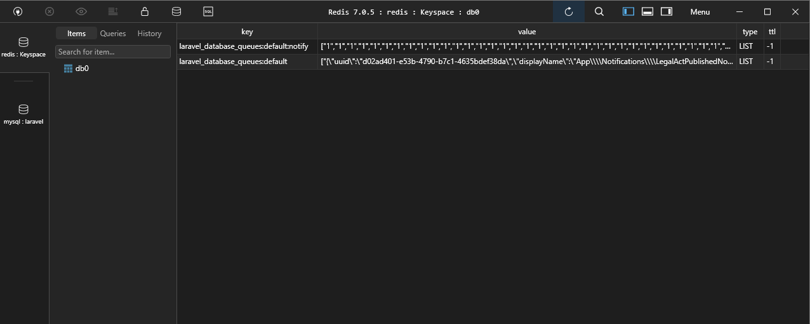
    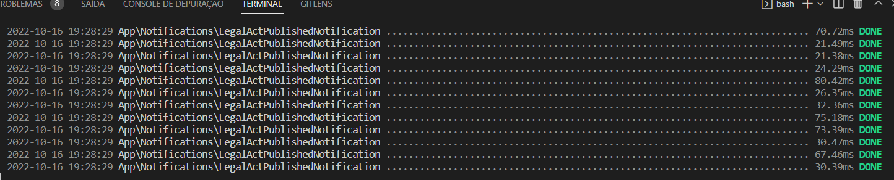
</h4>

### Testes automatizados
Pra quem não está ambientado com testes automatizados, certamente não está sendo tão produtivo quanto poderia ser. Eu tendo a programar meus testes junto com a funcionalidade que estou implementando, pois considero consigo testá-la de forma muito mais eficiente. Em vez de abrir janelas ou requisições em api, garanto uma forma bem mais rápida de testar todo meu sistema, garantido que assim nenhuma outra funcionalidade seja quebrada. Meu objetivo é um dia conseguir usar TDD (Test Driven Development) de forma abrangente em todos meus sistemas. 
Por ora, almejo ao menos garantir pelo menos 80% de cobertura de testes nos meus projetos. 
 <h4 align="center">
    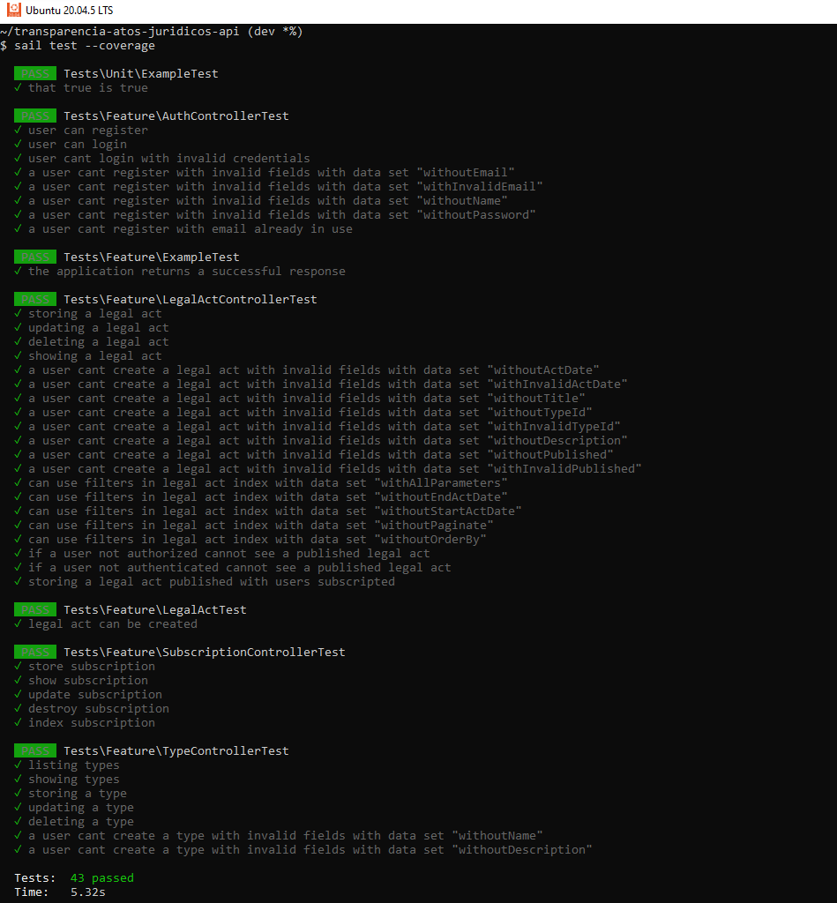
    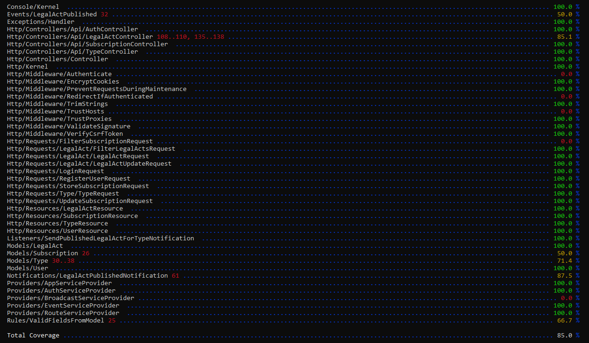
</h4>
Por padrão o Laravel Sail não vem com a cobertura de testes do XDEBUG ativada, porém você pode ativá-la com seguinte modificação do docker-compose.y`ml:
```
XDEBUG_MODE: '${SAIL_XDEBUG_MODE:-coverage}'
```
Depois basta apenas executar:
```
sail build --no-cache
```
### Ferramentas extras para testes
O Laravel Sail possui ferramentas que facilitam a vida do desenvolvimento, como o [MailHog](https://github.com/mailhog/MailHog) para testar envio de e-mails. Ele funciona interceptando e-mails enviados pela aplicação desenvolvida, provendo uma interface para verificá-los.
<h4 align="center">
    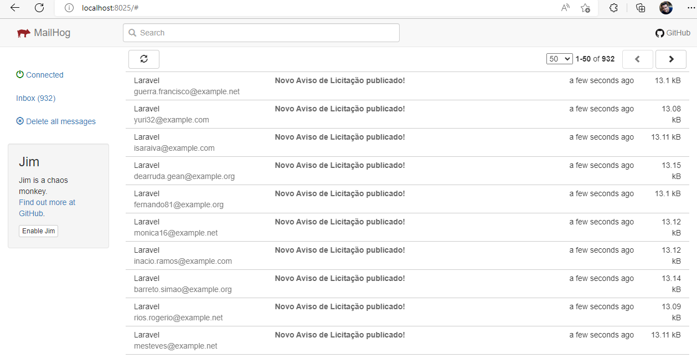
</h4>
Quando lidamos com upload de arquivos em buckets da S3, também dispomos de um serviço já integrado a instalação do Laravel Sail, chamado MinIO. Ele é uma ferramenta de código aberto e funciona como um armazenamento em nuvem compativo com o S3, e já tem um container configurado para funcionar com Sail. Então em vez de mandar arquivos para um bucket de teste na Amazon, podemos mandar para o container do MiniIO.  
<h4 align="center">
    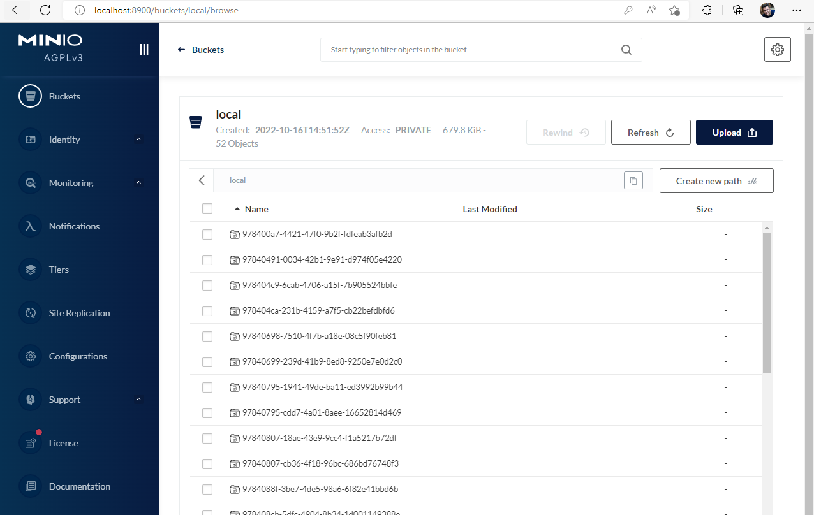
</h4>

## Melhorias futuras
- [ ] Refatorar a classe LegalActController, criando uma camada de repositório LegalActRepository para agrupar as parametrizações de filtros e querys.

## Como rodar esse projeto

Em construção ... 🔨

